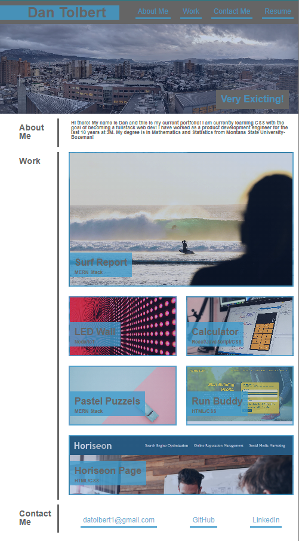

# dtolbert-portfolio-2023

## Description

Webpage for Dan Tolbert's portfolio in 2023.

CSS and HTML for layout using flex and media queries.

## Usage

Clickable links will take user to portfolio items/socialmedia/github/linkedin.
Site is responsive to browswer width and will be responsive.

https://treblotnad.github.io/dtolbert-portfolio-2023/

## Credits

All Assets provided by UofM bootcamp.

## License

Please refer to the LICENSE in the repo.